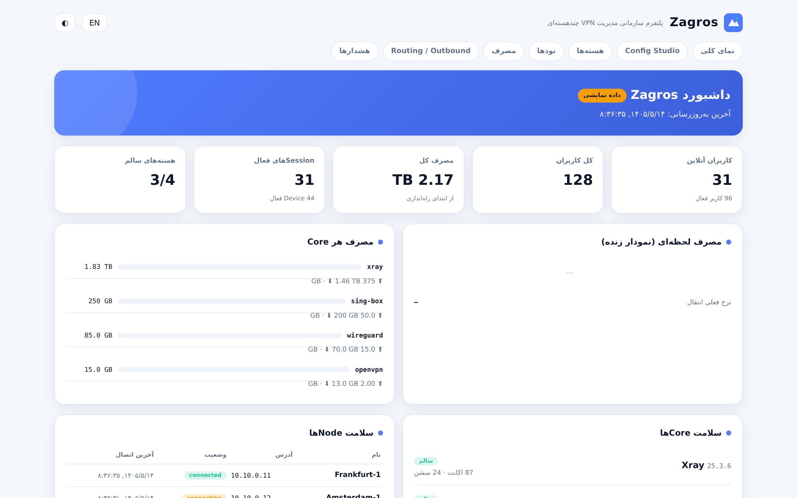
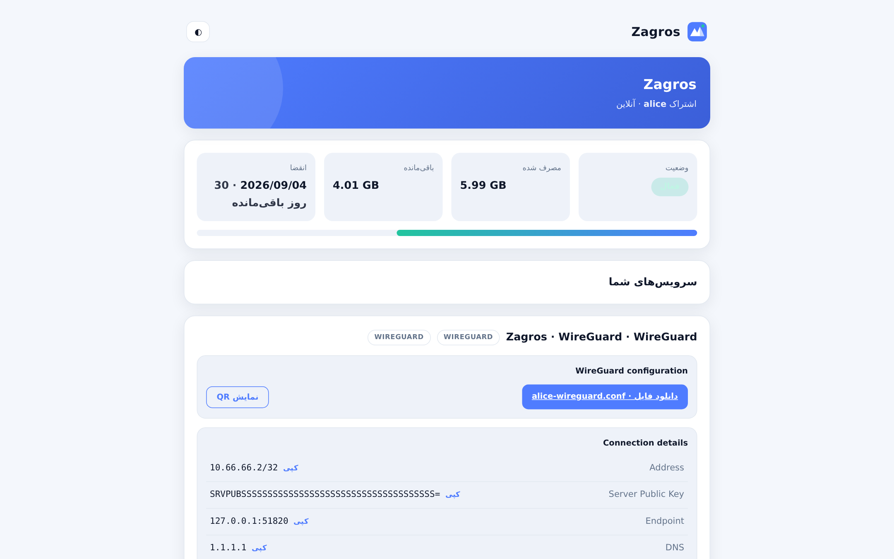
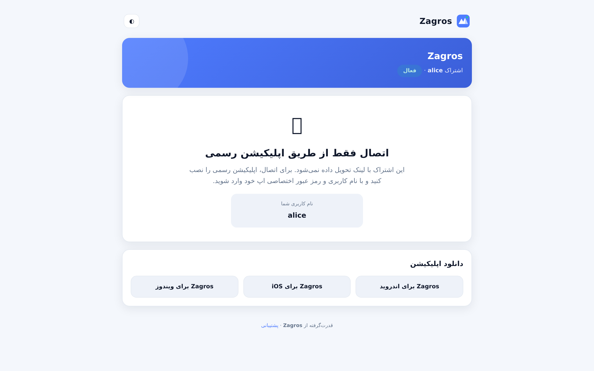
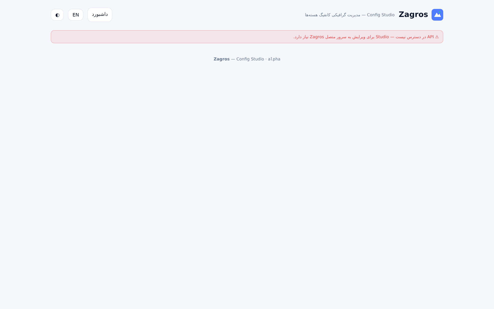

# Zagros

**Enterprise Multi-Core VPN Management Platform** — pluggable cores, unified
quota, unified devices, sealed client delivery.

Zagros treats every VPN technology as a **first-class plugin**: Xray is just
one driver among many, with no special status anywhere in the codebase.

> **Provenance:** Zagros is a hard-fork re-engineering of the
> [Marzban](https://github.com/Gozargah/Marzban) panel (v0.8.4, AGPL-3.0) into
> a fully plugin-based, multi-core platform. All upstream copyright and the
> AGPL-3.0 license are preserved (see `LICENSE`); the migration path from
> Marzban v0.8.x is built in and tested.

---

## ⚠️ Alpha Warning

**Current release: `1.0.0-alpha.7.4` — this is an ALPHA build.**

* Suitable for evaluation, testing and feedback — **not recommended for
  production** unless you fully understand the limitations.
* Expect breaking changes between alpha releases; read
  [`CHANGELOG.md`](CHANGELOG.md) (including *Known Limitations*) before
  upgrading.
* Security model is audited and hardened (see `docs/SECURITY-REVIEW.md`), but
  no external audit has been performed yet.

---

## Features

* **8 built-in core drivers** — xray, sing-box, WireGuard, OpenVPN,
  Hysteria 2, TUIC v5, SSH tunnel, SoftEther (L2TP/IPsec, SSTP, PPTP) — all
  behind one `BaseCoreDriver` contract.
* **Unified quota** — one counter per user across *all* cores
  (1 GB xray + 2 GB OpenVPN + 3 GB WireGuard + 4 GB sing-box = exactly
  10 GB), with persistent baselines (exactly-once across core restarts).
* **One user, any protocols from any cores** — a single dashboard user can
  hold VLESS from xray, Hysteria 2, WireGuard and SoftEther (PPTP/SSTP/L2TP)
  simultaneously, sharing ONE quota, ONE expiry and ONE global device limit
  (`core_access` grants; the built-in xray is a protected platform core).
* **Multi-format subscription** — the portal serves each granted config
  exactly once, auto-negotiated per client: share-link list (v2rayNG &
  friends), mihomo YAML (Clash / Clash Meta / Stash / FlClash) and complete
  sing-box JSON (SFI/SFA/SFM), with an explicit `?format=` override.
* **Unified Device & Session managers** — global device-limit enforcement and
  live cross-core session history.
* **Central Routing / Outbound / Policy engines** — capability-driven, with
  honest per-core reports (no silently dropped rules, ever).
* **Cross-core chaining** — chain traffic between heterogeneous cores
  (e.g. sing-box → WireGuard, xray → SSH) via native listeners.
* **Zagros Subscription Portal** — a driver-agnostic page rendering whatever
  each driver declares (share links, QRs, `.ovpn`/`.conf` files, credential
  fields). Two client modes: **Subscription Link** or **Application Login**.
* **Zagros App backend** — users log in with a username/app-password only;
  configs leave the server exclusively through sealed delivery
  (X25519 + HKDF-SHA256 + AES-256-GCM, self-contained crypto with a fast
  `cryptography` backend and an audited pure-Python fallback).
* **Config Studio** — graphical config management: a **fully dynamic**
  inbound wizard (Core → Protocol → Transport → Security → only the valid
  settings for that exact combination, served per-engine by the backend),
  JSON-tree editor producing RFC 6902 patches, schema-validated previews,
  unified diffs, Advanced raw-JSON mode — and applied changes materialize
  into the core itself for engines with a live bridge (sing-box, TUIC, …).
  Routine operations need **zero hand-written JSON**.
* **Modern persistence** — SQLAlchemy 2 + Alembic, encrypted credentials at
  rest (AES-256-GCM with row-bound AAD), idempotent Marzban → Zagros
  migration with dry-run reports and rollback.

## Multi-Core Architecture

Zagros is built around a strict plugin contract:

* `BaseCoreDriver` declares **capabilities** (stats, online tracking, hot
  reload, self-install, …) instead of core identity. Managers ask *“can you
  do X?”* — never *“are you xray?”*.
* Adding a new core = adding **one folder** under `app/cores/drivers/`.
  Zero changes anywhere else; drivers auto-register.
* Each driver owns its lifecycle: install (official upstream binaries) →
  render config → start/monitor → per-user sync → stats harvest → suspend /
  resume → delete.
* Cross-cutting services (quota, devices, sessions, routing, delivery,
  portal, studio) are driver-agnostic and negotiate through capabilities.
* Unsupported features are **reported explicitly** — Zagros never simulates
  or silently drops them. Example: TUIC has no stats API upstream, so its
  traffic is honestly reported as *unaccounted*.

Full design: [`docs/MULTICORE-ARCHITECTURE.md`](docs/MULTICORE-ARCHITECTURE.md)
— driver taxonomy & verdicts:
[`docs/DRIVER-TAXONOMY.md`](docs/DRIVER-TAXONOMY.md)

## Supported Cores

| Driver | Upstream | Management surface | Notes |
|---|---|---|---|
| xray | XTLS/Xray-core | Stats API + gRPC, hot reload | self-install incl. geoip/geosite |
| sing-box | SagerNet/sing-box | Clash API / experimental v2ray_api | pinned 1.12.4, schema 1.12 |
| hysteria2 | apernet/hysteria | official Traffic Stats API, Masquerade, ACL | per-user traffic/online/kick |
| tuic | EAimTY/tuic | config-only | **no stats upstream** (honest); upstream repo archived |
| openvpn | OpenVPN | Management Interface + mini-CA PKI | privileged (root) |
| wireguard | kernel + `wg` | per-peer handshake stats | privileged (root) |
| ssh | OpenSSH | system accounts + session probe | privileged (root) |
| softether | SoftEther VPN Server | `vpncmd` RPC (incl. L2TP/IPsec) | privileged (root) |

## Screenshots

| Operations Dashboard | Subscription Portal |
|---|---|
|  |  |

| Application-Login mode | Config Studio |
|---|---|
|  |  |

*Dashboard shows its honest offline-demo badge when the API is unreachable;
Config Studio requires a running Zagros API (sudo-admin token).*

## Installation

### One-command install (recommended)

The supported path is the installer from the
[zagros-scripts](https://github.com/ZagrosGM/zagros-scripts) repository. It
installs Docker if needed, renders the compose stack (panel + optional managed
database), generates secrets, pulls the GHCR image, waits for health, verifies
the schema and installs the `zagros` management CLI:

```bash
sudo bash -c "$(curl -fsSL https://raw.githubusercontent.com/ZagrosGM/zagros-scripts/main/zagros.sh)" -- install
# SQLite (default), or pick a managed engine:
sudo bash -c "$(curl -fsSL https://raw.githubusercontent.com/ZagrosGM/zagros-scripts/main/zagros.sh)" -- install --database postgresql
# engines: sqlite | mysql | mariadb | postgresql
```

Then:

```bash
sudo zagros create-admin --sudo     # first sudo admin
sudo zagros status                  # service, image, health, cores
sudo zagros doctor                  # full diagnostic report
sudo zagros install-core xray       # cores self-install their official binaries
```

Everyday operations — `zagros update` (auto-backup → pull → migrate → health →
auto-rollback), `zagros backup` / `zagros restore`, `zagros doctor` /
`zagros repair`, `zagros list-cores` / `install-core` / `update-core` … — are
documented in the
[zagros-scripts README](https://github.com/ZagrosGM/zagros-scripts#readme).

### Manual (development) install

Requirements: **Python ≥ 3.12**.

```bash
git clone https://github.com/ZagrosGM/Zagros.git
cd Zagros
pip install -r requirements.txt

cp .env.example .env        # set ZAGROS_SECRET_KEY (openssl rand -hex 32)
alembic upgrade head        # create the Zagros schema (platform + legacy stacks)
python3 zagros-cli.py admin create --sudo   # create the first sudo admin
python main.py              # panel on http://0.0.0.0:8000 (UVICORN_HOST/PORT)
```

Migrating from Marzban v0.8.x? The migration is idempotent and supports a
dry-run report first — see `docs/MULTICORE-ARCHITECTURE.md` (persistence
section) and `alembic upgrade head`.

## Configuration

Everything lives in **one `.env` file** — same operator model as Marzban,
with a couple of sharp edges removed:

| # | Contract |
|---|----------|
| 1 | The panel reads **only** `.env`. Nothing else (Dockerfile/compose/code) injects configuration. |
| 2 | Compose **mounts** the file (`./.env:/code/.env:ro`) instead of baking it into the container environment. |
| 3 | Edit the file (or `zagros config edit`) → `zagros restart` applies **every** setting. |
| 4 | Legacy `zagros.env` files are migrated to `.env` automatically (kept as `zagros.env.migrated`). |

Resolution order (highest first): real process environment (tests/CI only)
→ `.env` file → built-in defaults. The file location is resolved from the
package (CWD-independent), overridable via `ZAGROS_ENV_FILE`; the
installer places it at `/opt/zagros/.env`. See
[`.env.example`](.env.example) for the grouped reference of every setting.

**Bind host is honored verbatim.** `UVICORN_HOST` is never rewritten at
runtime (the historical "forced to 127.0.0.1 without TLS" trap is gone —
verified live with `ss -lntp` showing `0.0.0.0:8000`). Plain-HTTP binds just
print a loud warning. TLS is controlled by `TLS_MODE`:

| `TLS_MODE` | Behavior |
|------------|----------|
| `auto` (default) | TLS when both `UVICORN_SSL_CERTFILE`/`UVICORN_SSL_KEYFILE` are set, otherwise plain HTTP |
| `on` | TLS **required** — refuses to boot without cert+key |
| `off` | force plain HTTP (reverse proxy terminates TLS upstream) |

Identity settings: set `DOMAIN` once and `PANEL_BASE_URL`, `APP_BASE_URL`
and absolute subscription links derive from it automatically
(`SUBSCRIPTION_URL_PREFIX`, `SUBSCRIPTION_PATH`, `SUBSCRIPTION_TEMPLATE`
are the canonical overrides; the legacy `XRAY_*` names stay accepted).
`ALLOWED_ORIGINS` (CORS) and `TRUSTED_HOSTS` (Host-header allow-list) are
opt-in and empty by default.

## Docker

Release images are published to **GitHub Container Registry only**
(multi-arch: linux/amd64, linux/arm64):

```bash
docker pull ghcr.io/zagrosgm/zagros:v1.0.0-alpha.7.4
docker pull ghcr.io/zagrosgm/zagros:latest        # tracks stable releases
```

Every `v*` tag (stable, `-alpha`, `-beta`, `-rc`) triggers the release
pipeline: tests → multi-arch build → GHCR push → GitHub Release
(`.github/workflows/release.yml`). Docker Hub is not used.

Building locally works too — the dashboard is built inside the image:

```bash
docker build -t zagros:dev .
```

Note: privileged cores (WireGuard/OpenVPN/SoftEther/SSH) additionally need
`cap_add: NET_ADMIN` (and kernel support on the host). The installer stack
(`zagros install`) uses host networking like the upstream ecosystem expects.

## Development

```bash
pip install -r requirements.txt
python -m pytest tests/                # unit + integration (279 tests)
ZAGROS_E2E=1 python -m pytest tests/e2e -q -rs   # real-binary E2E (downloads official core binaries)
alembic upgrade head                   # schema
python main.py                         # run the panel
```

The management CLI has its own end-to-end harness in the
[zagros-scripts](https://github.com/ZagrosGM/zagros-scripts) repository
(189 assertions over install/config/backup/restore/update/rollback/doctor/
repair plus the .env mount contract & legacy migration, plus shellcheck),
runnable without a Docker daemon.

The core test suites (`tests/cores`, `tests/crypto`, `tests/portal`,
`tests/clientapi`, `tests/studio`, `tests/adminapi`) run dependency-free;
`tests/persistence` needs SQLAlchemy + Alembic and skips cleanly without
them. E2E downloads **real upstream core binaries** — mocks are never used
for core behavior.

## Build

* **Backend** — pure Python, no build step; `main.py` entrypoint, Alembic for
  schema versions. `Dockerfile` produces the all-in-one image.
* **Static UIs** (`ui/`) — zero-build HTML, served by the panel directly.
* **React dashboard** (`app/dashboard`) — `npm ci && npm run build`, or
  `./build_dashboard.sh` (outputs to `app/dashboard/build/`); CI rebuilds it
  automatically on version tags.

## Docs

* `docs/MULTICORE-ARCHITECTURE.md` — platform architecture (plugin system,
  capability matrix, delivery/portal/client-API design, P3 schema, roadmap).
* `docs/DRIVER-TAXONOMY.md` — why each of the 8 cores is an independent
  driver (with official-documentation references).
* `docs/SECURITY-REVIEW.md` — security audit, fixes, accepted risks.
* `docs/REAL-BINARY-NOTES.md` — 13 bugs found & fixed by testing against real
  upstream binaries.
* `docs/REFERENCE-ANALYSIS.md` — documented idea-level analysis of Marzban,
  3x-ui, vpn-ui and PasarGuard (accept/reject with reasons).

## Community

* **Telegram channel (announcements):** <https://t.me/zagrosgm>
* **Telegram group (discussion & support):** <https://t.me/zagrosgm_group>
* **GitHub repository:** <https://github.com/ZagrosGM/Zagros>
* **Installer & management CLI:** <https://github.com/ZagrosGM/zagros-scripts>

Want to help? Read [`CONTRIBUTING.md`](CONTRIBUTING.md) — driver development,
architecture rules, testing requirements and the review process are all
documented there.

## Roadmap

* Chain & Policy dedicated Studio wizards (post-alpha).
* Rate limiting on the legacy admin token endpoint.
* Privileged-core & multi-node real-binary E2E in CI.
* Signed release artifacts and provenance attestations for GHCR images.
* KMS/HSM master-key management.
* `1.0.0-beta.1` once the above exit criteria are met.

## Contributors

Zagros is built by the **Zagros Core Team** together with **community
contributors** — and this could be you: **future contributors** are welcome
in code, drivers, documentation, translations and testing. Everyone who
opens a merged pull request joins the project history.

Zagros stands on the shoulders of the upstream Marzban project; its authors
are credited through the preserved copyright and `LICENSE` notices (they are
not Zagros contributors — see the Provenance note at the top).

## License

AGPL-3.0 — see `LICENSE`. Zagros keeps the upstream Marzban license intact
and credits all upstream authors.
