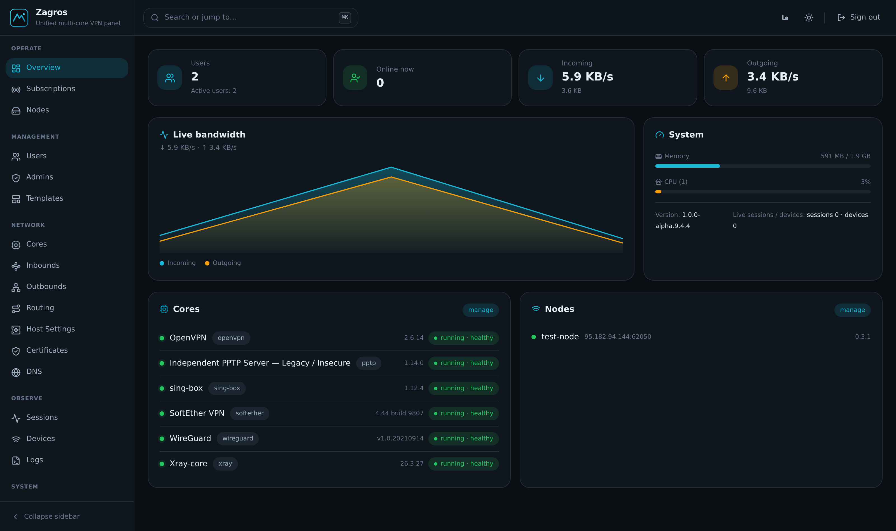
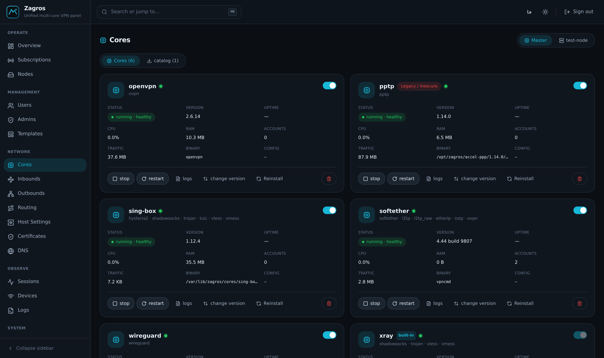
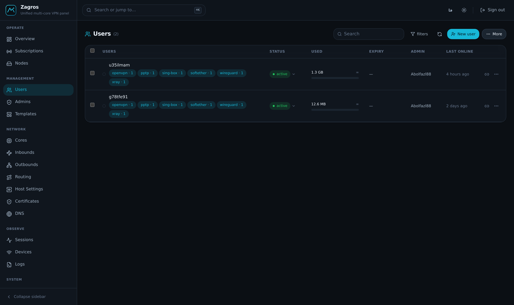
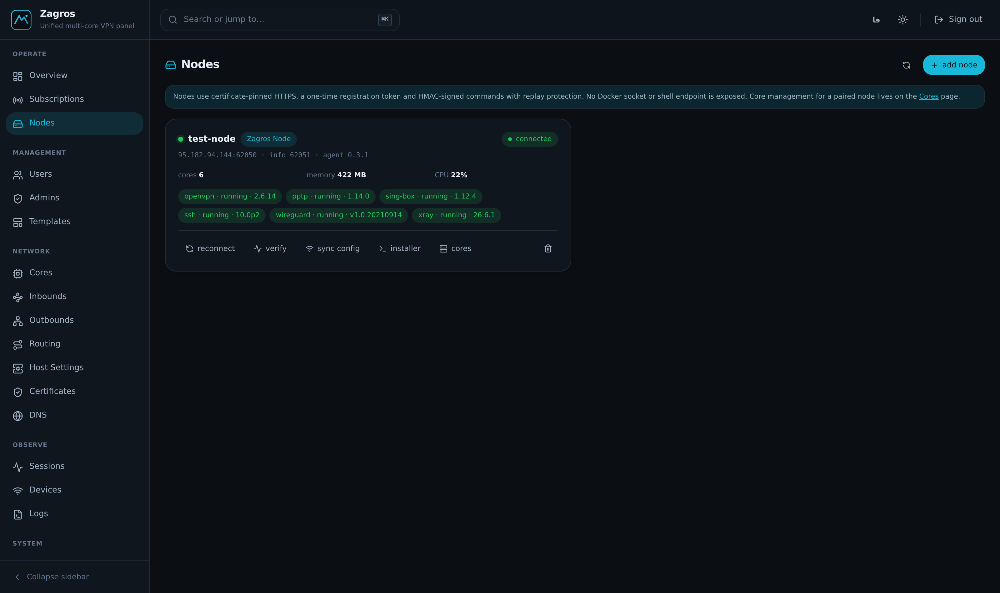
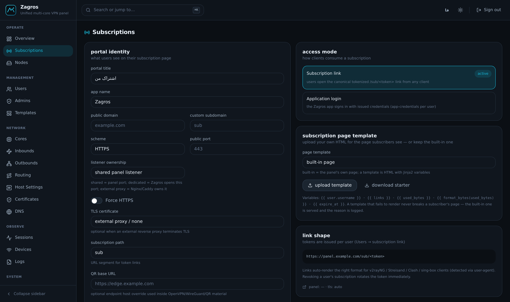
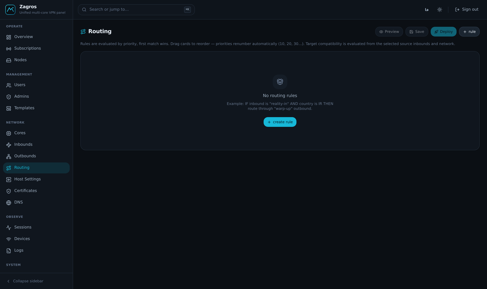
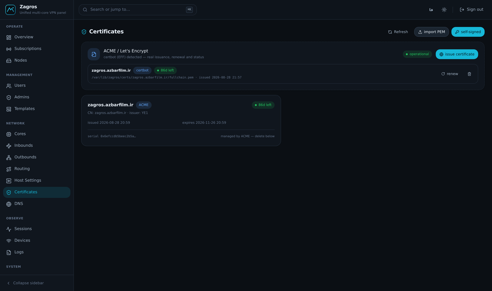

<div align="center">

# Zagros

**One panel. Every core. Full control.**

A multi-core VPN control panel that runs your cores on this host — and on as many nodes as you add.

[](LICENSE)
[](https://github.com/ZagrosGM/Zagros/pkgs/container/zagros)
[](https://github.com/ZagrosGM/zagros-docs)
[](#supported-cores)

### 📖 [**مستندات فارسی**](README_FA.md) &nbsp;·&nbsp; [**Documentation**](https://zagrosgm.github.io/zagros-docs) &nbsp;·&nbsp; [**Installation**](#installation)

</div>

---

## What Zagros is

Zagros is a hard fork of [Marzban](https://github.com/Gozargah/Marzban) that stops treating Xray as
*the* engine and starts treating every VPN core as a first-class citizen.

One dashboard user can hold protocols from **any** core at once. Their quota, IP limit, HWID device limit and
session presence are counted **once**, across every core and every node. They get **one**
subscription link, and the client receives whichever format it understands.

Nothing is simulated: every core self-installs its official upstream binary at runtime, and no core
binary is baked into the image.

<div align="center">



</div>

---

## Supported cores

| Core | Protocols | Managed by |
| --- | --- | --- |
| **Xray-core** | VLESS · VMess · Trojan · Shadowsocks | built-in, protected platform core |
| **sing-box** | Hysteria2 · TUIC v5 · and the Xray protocol family | self-installing driver |
| **OpenVPN** | UDP · TCP, multi-inbound | self-installing driver |
| **WireGuard** | WireGuard | self-installing driver |
| **SoftEther VPN** | SSTP · L2TP/IPsec · SoftEther native | self-installing driver |
| **SSH** | SSH tunnelling, with bidirectional accounting | OS-managed |
| **PPTP** | PPTP + MPPE *(legacy — insecure by design)* | bundled ACCEL-PPP runtime |

Every core is driven through the same capability-based driver interface, so install, configure,
start, meter and uninstall mean the same thing regardless of the engine underneath.

---

## Features

### Users and delivery
- **One user, many cores** — a single dashboard user carries protocols from any installed core.
- **Unified quota** — every core's usage folds into one counter set; a restart never re-counts old traffic.
- **Independent access limits** — cross-core source-IP ceilings temporarily block only the newest overflow IP; strict `X-Device-ID`/`X-HWID` enrollment limits subscription retrieval.
- **One subscription URL, many formats** — raw share links, Clash / Stash / FlClash (mihomo YAML),
  and complete sing-box JSON, negotiated from the client's User-Agent or forced with `?format=`.
- **Subscription portal** — browsers get a real page, and you can design it yourself.
- **Templates** — provision protocols, data limits and expiry from a reusable definition.

### Nodes
- **Nodes that join themselves** — run the installer, confirm the fingerprint, and the node pairs,
  adopts its server identity, receives accounts and reports usage back.
- **Certificate-pinned control plane** — node traffic rides pinned HTTPS on a separate port.
- **Per-node core inventory** — install and run different cores on different nodes.

### Operations
- **Config Studio** — schema-driven editing of inbounds, outbounds, routing and DNS with preview
  before deploy.
- **Import from a URL** — paste a `vless://`, `vmess://`, `trojan://`, `ss://`, `hysteria2://` or
  `tuic://` link and get a configured outbound.
- **Certificates** — issue via ACME, import your own, wildcard support.
- **Backup and restore** — database, config, certificates, keys and core state in one archive;
  scheduled backups included.
- **Migration** — import users from Marzban, PasarGuard and 3x-ui with a dry-run report first.
- **Admin governance** — per-admin caps on user count, expiry and traffic allocation, enforced
  race-safely.
- **Audit trail** — privileged operations are recorded.

### Security
- **Sudo-authenticated management API** — privileged operations require a sudo admin.
- **Sealed client delivery** — X25519 + HKDF + AES-256-GCM.
- **No Docker socket, no host PID namespace** — the panel container is not given the host.
- **Dual-backend crypto** — hardware AES-GCM where available.

### Interface
- **Dark and light themes**
- **English and Persian**, with full RTL layout
- **Command palette** — jump anywhere with <kbd>⌘</kbd>+<kbd>K</kbd>

<div align="center">

| Cores — every engine, one lifecycle | Users — one identity across cores |
| :---: | :---: |
|  |  |

| Nodes | Subscriptions |
| :---: | :---: |
|  |  |

| Routing | Certificates |
| :---: | :---: |
|  |  |

</div>

---

## Installation

One command. Pick the line that matches the database you want — everything else is provisioned for
you, including Docker if it is missing.

> **Requirements:** a fresh 64-bit Linux VPS (Ubuntu 22.04+ / Debian 12+ recommended), root access,
> and 1 GB RAM or more.

### SQLite — the default, best for small deployments

```bash
sudo bash -c "$(curl -fsSL https://raw.githubusercontent.com/ZagrosGM/zagros-scripts/main/zagros.sh)" -- install
```

### MySQL

```bash
sudo bash -c "$(curl -fsSL https://raw.githubusercontent.com/ZagrosGM/zagros-scripts/main/zagros.sh)" -- install --database mysql
```

### MariaDB

```bash
sudo bash -c "$(curl -fsSL https://raw.githubusercontent.com/ZagrosGM/zagros-scripts/main/zagros.sh)" -- install --database mariadb
```

### PostgreSQL

```bash
sudo bash -c "$(curl -fsSL https://raw.githubusercontent.com/ZagrosGM/zagros-scripts/main/zagros.sh)" -- install --database postgresql
```

When it finishes, open **`http://<server-ip>:8000/dashboard/`** and create your first admin:

```bash
sudo zagros advanced create-admin --sudo
```

> Put the panel behind TLS before you use it for anything real — see
> [TLS for the panel](https://github.com/ZagrosGM/zagros-docs/blob/main/examples/panel-tls.md).

### Adding a node

On the new server:

```bash
sudo bash -c "$(curl -fsSL https://raw.githubusercontent.com/ZagrosGM/zagros-scripts/main/install-node.sh)"
```

Then in the panel: **Nodes → the node you created → Connect**, and confirm the fingerprint the
installer printed.

### Updating

```bash
sudo bash -c "$(curl -fsSL https://raw.githubusercontent.com/ZagrosGM/zagros-scripts/main/zagros.sh)" -- update
```

The update takes a backup first and rolls itself back if the health check fails.

---

## Everyday commands

```bash
sudo zagros status        # service, image, health and the core table
sudo zagros logs -f       # follow the panel logs
sudo zagros restart       # recreate the panel — always applies .env edits
sudo zagros cores         # installed cores: state, version, health
sudo zagros env show      # the .env, with secrets masked
sudo zagros backup        # full backup: db, config, certs, keys, cores
sudo zagros restore latest
sudo zagros advanced doctor   # full system report
sudo zagros help
```

Full reference: [Command line](https://github.com/ZagrosGM/zagros-docs/blob/main/docs/cli.md).

---

## Documentation

| | |
| --- | --- |
| [Introduction](https://github.com/ZagrosGM/zagros-docs/blob/main/docs/introduction.md) | what Zagros is and how it is put together |
| [Installation](https://github.com/ZagrosGM/zagros-docs/blob/main/docs/installation.md) | every install path in detail |
| [Configuration](https://github.com/ZagrosGM/zagros-docs/blob/main/docs/configuration.md) | every environment variable |
| [Migration](https://github.com/ZagrosGM/zagros-docs/blob/main/docs/migration.md) | **from Marzban / 3x-ui, and SQLite → MySQL** |
| [Nodes](https://github.com/ZagrosGM/zagros-docs/blob/main/docs/nodes.md) | pairing, inventory, troubleshooting |
| [Cores](https://github.com/ZagrosGM/zagros-docs/blob/main/docs/cores.md) | per-core installation and behaviour |
| [Users](https://github.com/ZagrosGM/zagros-docs/blob/main/docs/users.md) | quotas, devices, templates |
| [Subscriptions](https://github.com/ZagrosGM/zagros-docs/blob/main/docs/subscriptions.md) | formats and the portal |
| [Certificates](https://github.com/ZagrosGM/zagros-docs/blob/main/docs/certificates.md) | ACME, import, wildcards |
| [REST API](https://github.com/ZagrosGM/zagros-docs/blob/main/docs/api.md) | integrate with anything |
| [Troubleshooting](https://github.com/ZagrosGM/zagros-docs/blob/main/docs/troubleshooting.md) | when something is wrong |

---

## Project layout

| Repository | What it holds |
| --- | --- |
| [**Zagros**](https://github.com/ZagrosGM/Zagros) | the panel — API, core drivers, dashboard |
| [**zagros-scripts**](https://github.com/ZagrosGM/zagros-scripts) | installers, the `zagros` host CLI, host agents |
| [**zagros-node**](https://github.com/ZagrosGM/zagros-node) | the node agent and its image |
| [**zagros-docs**](https://github.com/ZagrosGM/zagros-docs) | the documentation site |

---

---

## 🌐 Zagros Community

- 📢 **Official Channel:** [https://t.me/zagrosgm](https://t.me/zagrosgm)
- 💬 **Official Group:** [https://t.me/zagrosgm_group](https://t.me/zagrosgm_group)

## Contributing

Bug reports and pull requests are welcome. Development material — the test suites, architecture
notes and internal tooling — lives in a separate repository so that a release contains only what an
operator installs.

Please keep the honesty contract this project is built on: **no TODOs, no placeholders, and no
claim in the interface that the code does not actually deliver.** If a value cannot be measured,
the panel says so rather than showing a plausible number.

---

## License

Licensed under the [AGPL-3.0](LICENSE). Third-party components are listed in
[THIRD_PARTY_NOTICES.md](THIRD_PARTY_NOTICES.md).

Zagros is a hard fork of [Marzban](https://github.com/Gozargah/Marzban) — thanks to Gozargah and
every upstream core project.

---

<div align="center">

**[⬆ Back to top](#zagros)** &nbsp;·&nbsp; [مستندات فارسی](README_FA.md)

</div>
